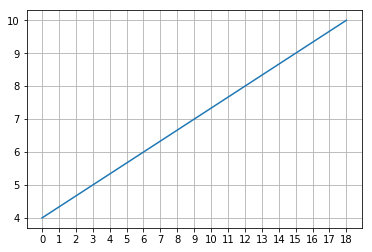

# Sisyphus使用例子

sisyphus文件夹是一个python的包，使用的时候只需要在sisyphus文件夹外创建自己的python文件，然后像下面的例子一样导入必要的内容就可以使用了。

### 导入画图需要的库


```python
import matplotlib.pyplot as plt
import numpy as np
%matplotlib inline
```

### VN的基础属性数据


```python
from sisyphus import Champion

vn = Champion('Vayne')
vn.stats
```


    {'armor': 24.216,
     'armorperlevel': 3.7,
     'attackdamage': 61.176,
     'attackdamageperlevel': 3.2,
     'attackrange': 125,
     'attackspeedoffset': -0.04,
     'attackspeedperlevel': 3,
     'crit': 0,
     'critperlevel': 0,
     'hp': 570.8,
     'hpperlevel': 85,
     'hpregen': 7.425,
     'hpregenperlevel': 0.7,
     'movespeed': 350,
     'mp': 200,
     'mpperlevel': 0,
     'mpregen': 50,
     'mpregenperlevel': 0,
     'spellblock': 32.1,
     'spellblockperlevel': 1.25}


### 基本用法


```python
from sisyphus.util.shelve_tool import rune_full
from sisyphus import Item, Champion

vn = Champion('Vayne')
print('攻击力: ', vn.attackdamage)
vn.build_runes('5245')  # 装备增加0.95攻击力的符文
print('攻击力: ', vn.attackdamage)

print('-----------------------')

vn.build('3031')  # 3031是无尽之刃的ID
print('攻击力:', vn.attackdamage)
print('暴击概率:', vn.crit,)
print('暴击伤害:', vn.critdamage)

print('-----------------------')


vn.update_lv(18)  # 十八级时的属性变化
print('攻击力:', vn.attackdamage)
print('暴击概率:', vn.crit,)
print('暴击伤害:', vn.critdamage)
# 所有符文的ID，可以在static/raw_data/rune.json中找到详细信息
runes = rune_full.item_keys()
```

    攻击力:  55.88
    攻击力:  56.825
    -----------------------
    攻击力: 126.825
    暴击概率: 0.2
    暴击伤害: 1.5
    -----------------------
    攻击力: 155.04500000000002
    暴击概率: 0.2
    暴击伤害: 1.5


### 固定护甲穿透随等级的变化


```python
x = np.arange(19)
y = 0.4 * 10 + (0.6*10*x)/18 # 假设护甲穿透属性值为10，实际效果是线性变化的
fig, ax = plt.subplots()
xticks = list(range(0, len(x), 1))
xlabels = [x[index] for index in xticks]
xticks.append(len(x))
xlabels.append(x[-1])
ax.set_xticks(xticks)
ax.set_xticklabels(xlabels)
ax.set

print(y)
plt.plot(y)
plt.grid()
```

    [  4.           4.33333333   4.66666667   5.           5.33333333
       5.66666667   6.           6.33333333   6.66666667   7.           7.33333333
       7.66666667   8.           8.33333333   8.66666667   9.           9.33333333
       9.66666667  10.        ]




